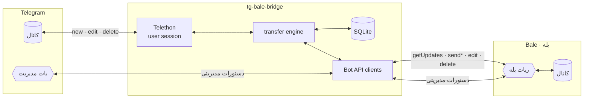

<div align="center">


<br/>

[](https://github.com/parham7991/tg-bale-bridge/actions/workflows/ci.yml)
[](https://www.python.org/)
[](LICENSE)
[](tests/)
[](CONTRIBUTING.md)

**پل دوطرفهٔ همگام‌سازی کانال‌های تلگرام و بله** — هرچه یک‌طرف بگذارید، بی‌کم‌وکاست در طرف دیگر می‌نشیند.<br/>
*Two-way Telegram ⇄ Bale (بله) channel sync bridge — mirror everything.*

</div>

---

## 📑 فهرست

- [✨ چرا این پروژه؟](#-چرا-این-پروژه)
- [🎬 نمای کلی قابلیت‌ها](#-نمای-کلی-قابلیت‌ها)
- [🏗 معماری](#-معماری)
- [🚀 راه‌اندازی سریع](#-راه‌اندازی-سریع)
- [🆘 ربات بله را نمی‌توان در کانال اد کرد؟](#-ربات-بله-را-نمیتوان-در-کانال-اد-کرد)
- [🎛 پنل مدیریت — چهار راه کنترل](#-پنل-مدیریت--چهار-راه-کنترل)
- [🌐 داشبورد وب](#-داشبورد-وب)
- [⚙️ پیکربندی](#️-پیکربندی)
- [🧪 تست و توسعه](#-تست-و-توسعه)
- [⚠️ محدودیت‌های صادقانه](#️-محدودیت‌های-صادقانه)
- [🗺 نقشه راه](#-نقشه-راه)
- [🤝 مشارکت](#-مشارکت)
- [📄 مجوز](#-مجوز)

## ✨ چرا این پروژه؟

| ویژگی | توضیح |
|:---|:---|
| 🔁 **دوطرفه واقعی** | با یک پارامتر جهت را انتخاب کنید: `tg2bale` ، `bale2tg` یا `both` |
| 📦 **همه‌چیز** | متن، عکس، ویدیو، وویس، موزیک، گیف، فایل، استیکر، آلبوم چندتایی، فورواردی، ریپلای، لوکیشن، مخاطب |
| ✏️ **ویرایش = ویرایش** | پیام را در تلگرام ادیت کنید → همان پیام در بله ادیت می‌شود (و برعکس) |
| 🗑 **حذف = حذف** | حذف در هر دو سو، کپی را در سمت دیگر پاک می‌کند (بله→تلگرام در حالت سلف‌بات) |
| 🕵️ **سلف‌بات بله (aiobale)** | با حساب کاربری خودتان در کانال بله بفرستید — حتی وقتی ربات بله اصلاً در کانال اد نمی‌شود! |
| 🎨 **قالب‌بندی حفظ می‌شود** | بولد/ایتالیک/لینک تلگرام ⇄ Markdown بله |
| 🧩 **بدون حلقه** | نگهبان دو‌لایه (ledger شناسه + اثرانگشت محتوا) مانع بازتاب بی‌نهایت می‌شود |
| 🌐 **داشبورد وب همه‌فن‌حریف** | دارک، RTL، زنده: جفت‌ها، جهت‌ها، توقف/ادامه، لاگ زنده، تست دسترسی، ادمین‌کردن ربات — همه از مرورگر |
| 🎛 **پنل چهارسطحی متصل** | مدیریت از چهار جا: ربات بله · خودچت بله (سلف‌بات جواب می‌دهد!) · بات تلگرام · Saved Messages — همه یک پنل |
| 🤖 **بات تلگرام برای مدیریت سلف‌بات** | کنترل کامل از راه دور: توقف/ادامه، لاگ زنده، هویت، ساخت جفت — با بات تلگرام |
| 🧪 **۱۶۱ تست آفلاین** | pytest شامل تست‌های واحد و سرتاسری — CI روی پایتون ۳.۱۰ تا ۳.۱۲ |
| 🐳 **داکر و systemd** | آمادهٔ استقرار روی سرور |

## 🎬 نمای کلی قابلیت‌ها

| محتوا | تلگرام→بله | بله→تلگرام |
|---|:---:|:---:|
| متن + بولد/ایتالیک/لینک | ✅ | ✅ |
| عکس · ویدیو · وویس · موزیک · گیف · فایل | ✅ | ✅ |
| استیکر (به‌صورت تصویر/فایل) | ✅ | ✅ |
| آلبوم (رسانه گروهی) | ✅ | ✅ (در حالت سلف‌بات: تک‌تک) |
| فورواردی (با ذکر منبع) | ✅ | ✅ (در حالت سلف‌بات: بدون ذکر منبع) |
| جواب/ریپلای (به پیام معادل) | ✅ | ✅ |
| لوکیشن و مخاطب | ✅ | ✅ |
| ویدیوی دایره‌ای | ✅ (با فالبک) | ➖ *API بله ندارد* |
| نظرسنجی و تاس | ✅ (به‌صورت متن) | ➖ |
| **ویرایش پیام** | ✅ | ✅ |
| **حذف پیام** | ✅ | ✅ *(حالت سلف‌بات)* · ⛔ *حالت ربات* |

## 🏗 معماری

**هر بخش، یک ماژول مستقل و یک موتور متمرکز:**

| ماژول | موتور | مسئولیت |
|---|---|---|
| `bridge/transfer.py` | 🔄 موتور آینه‌سازی | صف‌ها، محتوا، آلبوم، ویرایش، حذف — قلب پل |
| `bridge/admin.py` | 🎛 موتور پنل | دستورات مدیریتی روی همهٔ سطوح |
| `bridge/wizard.py` | 🧙‍♂️ موتور نصب | ویزارد داخل بات + پروب‌های واقعی |
| **`bridge/tgbot/`** | ✈️ بستهٔ بات تلگرام | ↓ تفکیک کامل ↓ |
| `tgbot/session.py` / `routing.py` | 🎧 نشست و مسیریابی | هویت + آفست، روتر رویدادها |
| `tgbot/claim.py` / `guards.py` | 👑 ادمین خودکار و نگهبان | اولین /start ادمین می‌شود؛ رد غیرادمین |
| `bridge/tg_user.py` | ✈️ سلف تلگرام | Telethon — حساب کاربری |
| **`bridge/bale/`** | 🟡 بستهٔ بله (سلف) | ↓ تفکیک کامل ↓ |
| `bale/session.py` + `events.py` | 🎧 نشست و رویدادها | کلاینت aiobale، کش‌ها، listen، رویداد حذف |
| `bale/sender.py` / `editor.py` / `files.py` | 📤 ارسال/ویرایش/فایل | همهٔ send_* با فالبک کامل، ویرایش/حذف، دانلود |
| `bale/resolver.py` / `normalize.py` / `types_map.py` | 🔧 تبدیل و شناسایی | شناسه/نوع چت، نرمال‌سازی ⇄ Bot-API |
| `bale/admin_ops.py` / `profile.py` | 👑 ادمین و پروفایل | ادمین‌کردن ربات توسط سلف، get_me/get_chat |
| `bale/gateway.py` / `routing.py` / `facade.py` | 🚪 دروازه و مسیریابی | resolve + پروب، روتر رویدادها، نمأی سازگاری |
| `bridge/bot_api.py` | 🟡 BotAPI عمومی بله | حالت ربات و همهٔ توکن‌ها |
| `bridge/db.py` / `store.py` | 💾 موتور داده | نگاشت‌ها + تنظیمات زمان اجرا |
| `bridge/formatter.py` | 🎨 موتور قالب | تلگرام ⇄ بله مارک‌داون، UTF-16 |
| `bridge/logbuf.py` | 📜 موتور لاگ | بافر حلقه‌ای زنده |
| **`bridge/dashboard/`** | 🌐 بستهٔ داشبورد | ↓ تفکیک کامل ↓ |
| `dashboard/app.py` | مونتاژ | کلاس Dashboard + aiohttp |
| `dashboard/api.py` | لایهٔ HTTP | میدلور (خطا/CSRF/سشن) + هندلرهای نازک |
| `dashboard/auth.py` | 🔐 احراز هویت | PBKDF2، سشن، قفل تلاش |
| `dashboard/context.py` | 🧭 زمینه | دسترسی تایپ‌شده به وضعیت زنده |
| `dashboard/engines/status.py` | 📊 وضعیت | اسنپ‌شات کامل پل |
| `dashboard/engines/pairs.py` | 🔗 جفت‌ها | CRUD + resolve واقعی |
| `dashboard/engines/control.py` | ⏸ کنترل | توقف/ادامهٔ سراسری |
| `dashboard/engines/logs.py` | 📜 لاگ | دمِ بافر حلقه‌ای |
| `dashboard/engines/ops.py` | 🛡 عملیات | پروب دسترسی + ادمین‌کردن ربات |




مستندات کامل معماری (مودل داده، دیاگرام ترتیب پیام، استراتژی وفاداری):
[**docs/architecture.md**](docs/architecture.md)

## 🚀 راه‌اندازی ۶۰ ثانیه‌ای — فقط یک توکن!

**تنها چیزی که لازم است: توکن یک بات تلگرام (از @BotFather). بقیه‌اش از داخل خود بات:**

```bash
git clone https://github.com/parham7991/tg-bale-bridge.git
cd tg-bale-bridge
python -m venv .venv && source .venv/bin/activate
pip install -r requirements.txt

echo "TG_BOT_TOKEN=123456:ABC..." > .env
python main.py              # ▶️ حالت نصاب بالا می‌آید
```

حالا در تلگرام به بات‌تان `/start` بدهید — **اولین نفر ادمین می‌شود** (هیچ شناسه عددی لازم نیست) — و ویزارد باز می‌شود:

| دکمه | کار |
|---|---|
| 📱 سلف تلگرام | api_id/api_hash + شماره + کد (و رمز دوم) — همه در همان چت |
| 🟡 سلف بله | شماره + کد پیامکی بله — نشست aiobale ساخته می‌شود |
| 🤖 ربات بله | فقط توکن را paste کنید |
| 🔗 جفت کانال‌ها | فوروارد یک پیام از کانال تلگرام (یا @آیدی) + @آیدی کانال بله + انتخاب جهت با دکمه |
| 🛡 ادمین‌کردن ربات | **سلف بله (که ادمین کانال است) خودش ربات بله را اضافه و ادمین می‌کند** و در پایان ارسال واقعی ربات را تست می‌کند |
| 📊 وضعیت نصب | چه چیزهایی آماده است |
| ✅ اتمام | برنامه خودش ری‌استارت می‌شود و پل کامل بالا می‌آید 🚀 |

بعد از هر جفت‌کردن، **دسترسی واقعی هر حساب تست می‌شود** (ارسال/حذف پیام آزمایشی) و گزارش
✔/✘ می‌گیرید: «سلف تلگرام ✔ · سلف بله ✔ · ربات بله ✘». هر وقت هم خواستید: `/access`.

<details>
<summary>🔧 راه پیشرفته (همه‌چیز در .env — مثل قبل)</summary>

```bash
cp .env.example .env        # ← مقادیر را کامل کنید
python login.py             # ← ورود به تلگرام (یک بار، کد تایید می‌خواهد)
python login_bale.py        # ← فقط برای حالت سلف‌بات بله (BALE_MODE=user)
python main.py              # ▶️
```
</details>

<details>
<summary>🐳 اجرا با Docker</summary>

```bash
cp .env.example .env        # ← مقادیر را کامل کنید
docker compose run --rm bridge python login.py   # ورود یک‌باره
docker compose up -d
docker compose logs -f
```
</details>

<details>
<summary>🐧 استقرار حرفه‌ای (systemd) و نکات سرور</summary>

به [**docs/DEPLOY.md**](docs/DEPLOY.md) مراجعه کنید.
</details>

**پیش از اجرا:**
1. از [my.telegram.org](https://my.telegram.org) → `api_id` و `api_hash` بگیرید
2. در بله به [`@botfather`](https://ble.ir/botfather) بروید و ربات بسازید → توکن
3. حساب تلگرام عضو کانال(های) مبدأ باشد؛ برای کانال(های) مقصد بله **یا** ربات بله ادمین با دسترسی ارسال/ویرایش/حذف باشد (اگر نمی‌شود ← بخش «ربات بله را نمی‌توان در کانال اد کرد؟») **یا** حالت سلف‌بات `BALE_MODE=user` روشن باشد

## 🆘 ربات بله را نمی‌توان در کانال اد کرد؟

نسخه‌های جدید بله معمولاً اجازه نمی‌دهند ربات را به‌عنوان ادمین کانال اضافه کنید (حتی پیدا کردن ربات با آیدی هم سخت شده است). سه راه‌حل، از موقت تا قطعی:

1. **از نسخهٔ موبایل بله** امتحان کنید — افزودن ادمین فقط در اپ موبایل جواب می‌دهد:
   تنظیمات کانال ← **مدیران** ← **افزودن مدیر** ← آیدی ربات را **با `@`** جستجو کنید (مثلاً `@my_bot`).
   قبلش حتماً یک بار در چت خصوصی به ربات `/start` بزنید.
2. **نسخهٔ وب بله** گاهی هنوز اجازهٔ ذخیرهٔ ربات به‌عنوان مخاطب را می‌دهد؛ بعد از ذخیره، ربات در
   جستجوی «افزودن مدیر» پیدا می‌شود. (یا از کسی که ربات را دارد بخواهید برایتان بفرستد.)
3. **راه‌حل قطعی: اصلاً ربات را اد نکنید!** حالت سلف‌بات بله (`BALE_MODE=user`) را روشن کنید —
   پل با **حساب کاربری خودتان** در کانال می‌نویسد (هر کانالی که عضوش هستید و اجازهٔ ارسال دارید)، بدون هیچ رباتی:

   ```env
   BALE_MODE=user
   ```
   ```bash
   python login_bale.py   # ورود با شماره تلفن + کد پیامکی (فقط یک بار)
   python main.py
   ```

   در این حالت یک قابلیت همه‌فن‌حریف هم می‌گیرید: رویداد **حذف پیام** در بله در دسترس می‌شود ⇒
   **همگام‌سازی حذف بله→تلگرام** هم فعال می‌شود — چیزی که ربات بله هرگز نمی‌دهد.

   🛡 **جالب‌تر:** اگر سلف بله در کانال ادمین باشد، *خودش* می‌تواند ربات بله را به کانال اضافه و
   ادمین کند — دکمهٔ «🛡 ادمین‌کردن ربات» در ویزارد (یا دستور `/promote`). سلف اول ربات را
   پیدا می‌کند (`search_username`)، بعد `invite` + `make_user_admin` داخلی را می‌زند و در پایان
   **ارسال واقعی ربات را تست می‌کند**. (اگر سرور بله به هر دلیل رد کرد، همان حالت سلف به‌تنهایی
   کامل است — ربات فقط یک پنل ادمین اضافه است.)

> 🧩 موتور این قابلیت، کتابخانهٔ [`aiobale`](https://github.com/aminmadaniofficial/aiobale) است —
> پیاده‌سازی غیررسمی API داخلی بله (WebSocket + protobuf) با پشتیبانی کامل حساب کاربری.
> نشست شما در `data/session.bale` ذخیره می‌شود و هیچ رمزی نگه داشته نمی‌شود.

## 🎛 پنل مدیریت — چهار راه کنترل

هر چهار سطح به **یک** پنل مدیریتی وصل‌اند — از هرکدام که بروید همان دستورات را می‌بینید:

| سطح | چطور؟ | تنظیم لازم |
|---|---|---|
| 🤖 ربات بله | به ربات بله پیام بدهید | `BALE_TOKEN` (در حالت bot الزامی · در حالت user = پنل اضافه) |
| 💬 **خودچت بله** | در بله به **خودتان** پیام بدهید — سلف‌بات همان‌جا جواب می‌دهد! | هیچ! در `BALE_MODE=user` خودکار ادمین می‌شوید |
| 🤖 بات تلگرام | به بات مدیریت تلگرام پیام بدهید | `TG_BOT_TOKEN` + `ADMIN_TG_ID` |
| ⭐ Saved Messages تلگرام | به خودتان در تلگرام پیام بدهید | هیچ |

> 💡 **حالت ترکیبی:** اگر هم `BALE_MODE=user` باشد و هم `BALE_TOKEN`، ربات بله در کنار سلف‌بات
> به‌عنوان پنل ادمین اضافه فعال می‌شود (میرور کانال‌ها فقط از سشن کاربر — بدون دوباره‌کاری).

| دستور | کار |
|---|---|
| `/add <کانال_تلگرام> <کانال_بله> [حالت]` | اتصال دو کانال — نمونه: `/add @tg_ch @bale_ch both` |
| `/list` | فهرست جفت‌های متصل |
| `/mode <id> <حالت>` | تغییر جهت: `both` / `tg2bale` / `bale2tg` |
| `/remove <id>` | حذف یک جفت |
| `/test <id>` | پیام آزمایشی برای اطمینان از اتصال |
| `/id` *(یا فوروارد پیام از کانال)* | گرفتن شناسه عددی کانال‌ها |
| `/access` | تست واقعی دسترسی سلف‌ها/ربات به کانال‌های هر جفت |
| `/promote [@ربات_بله]` | سلف بله ربات را به کانال‌ها اضافه و ادمین می‌کند |
| `/whoami` | هویت حساب‌ها: سلف‌بات، ربات بله، بات مدیریت |
| `/pause` · `/resume` | توقف/ادامهٔ موقت همگام‌سازی (ماندگار بین ری‌استارت‌ها) |
| `/logs [n]` | آخرین n خط لاگ زندهٔ برنامه |
| `/status` · `/help` | وضعیت (حالت، جفت‌ها، آمار، زمان فعالیت) و راهنما |

## 🌐 داشبورد وب

مدیریت کل پل از مرورگر — دارک، فارسی/RTL، زنده:

| بخش | کار |
|---|---|
| 📊 کارت‌های وضعیت | جفت‌ها، پیام‌های همگام‌شده، حالت بله، زمان فعالیت |
| 👥 حساب‌ها | سلف تلگرام، حساب/ربات بله، بات کنترل — با نشانگر اتصال |
| 🔗 جدول جفت‌ها | تغییر جهت با یک کلیک (دوطرفه/تلگرام→بله/بله→تلگرام)، حذف، افزودن با مودال |
| ⏸ کلید توقف | توقف/ادامهٔ کل همگام‌سازی (ماندگار) |
| 📜 لاگ زنده | ترمینال رنگی با دنبال‌کردن خودکار |
| 🔓 تست دسترسی | پروب واقعی هر حساب به کانال‌ها (همان `/access`) |
| 🛡 ادمین‌کردن ربات | سلف بله، ربات را به کانال‌ها ادمین می‌کند (همان `/promote`) |

**ورود:** یوزرنیم/رمز از داخل بات تلگرام: `/dashboard` (رمز اولیه یک‌بار می‌سازد و نشان می‌دهد) ·
`/passwd <رمز>` و `/dashuser <نام>` برای تغییر · تغییر رمز از خود داشبورد هم می‌شود.
پیش‌فرض: `http://<IP-سرور>:8080` — با `DASH_HOST/DASH_PORT/DASH_ENABLED` تنظیم می‌شود.

🔐 امنیت: رمز با PBKDF2 (۱۰۰هزار دور) هش می‌شود · سشن کوکی HttpOnly/SameSite=Strict ·
ضد-CSRF · قفل ۶۰ ثانیه‌ای بعد از ۵ ورود غلط.

### 🤖 راه‌اندازی بات مدیریت تلگرام (مدیریت سلف‌بات)

1. در تلگرام به [@BotFather](https://t.me/BotFather) بروید → `/newbot` → توکن بگیرید
2. در `.env` بگذارید:
   ```env
   TG_BOT_TOKEN=123456:ABC-DEF...
   ```
3. برنامه را اجرا کنید و به بات جدید پیام `/start` بدهید → آیدی عددی‌تان را می‌گوید
4. آیدی را در `.env` بگذارید و دوباره اجرا کنید:
   ```env
   ADMIN_TG_ID=987654321
   ```
5. تمام! از این پس می‌توانید سلف‌بات را **از هرجا** با این بات مدیریت کنید

> 💡 اگر `TG_BOT_TOKEN` خالی بماند، پل مثل قبل کار می‌کند و فقط این بات غیرفعال است.
> دستورات از داخل **ربات بله** و **پیام‌های ذخیره‌شده تلگرام** هم همیشه در دسترس‌اند.

## ⚙️ پیکربندی

| کلید | الزامی | توضیح |
|---|:---:|---|
| `TG_API_ID` | ✅ | از my.telegram.org |
| `TG_API_HASH` | ✅ | از my.telegram.org |
| `TG_PHONE` | ✅ | شماره تلفن حساب تلگرام |
| `BALE_TOKEN` | ✅* | توکن ربات بله از @botfather — در `BALE_MODE=user` فقط برای پنل ربات بله لازم است |
| `BALE_MODE` | – | `bot` (پیش‌فرض) یا `user` = سلف‌بات؛ اگر `BALE_TOKEN` هم بدهید ربات بله هم به‌عنوان پنل ادمین فعال می‌شود |
| `BALE_SESSION` | – | مسیر فایل نشست سلف‌بات، پیش‌فرض `data/session.bale` |
| `BALE_PHONE` | – | شماره تلفن بله برای ورود سلف‌بات (اختیاری) |
| `ADMIN_BALE_ID` | ✅ | آیدی عددی شما در بله (برای دستورات) |
| `TG_BOT_TOKEN` | – | توکن بات مدیریت تلگرام (اختیاری — از @BotFather) |
| `ADMIN_TG_ID` | – | آیدی عددی شما در تلگرام (برای دستورات بات مدیریت) |
| `ALBUM_DELAY` | – | تاخیر جمع‌آوری آلبوم، پیش‌فرض `0.9` ثانیه |
| `BALE_POLL_TIMEOUT` | – | مدت long-polling بله، پیش‌فرض `30` ثانیه |
| `DATA_DIR` | – | مسیر دیتابیس و سشن، پیش‌فرض `./data` |

## 🧪 تست و توسعه

```bash
make dev      # نصب وابستگی‌های توسعه
make test     # اجرای ۱۶۱ تست آفلاین (بدون نیاز به اکانت واقعی)
make lint     # ruff
```

- CI روی هر push / PR: lint + pytest روی پایتون ۳.۱۰ / ۳.۱۱ / ۳.۱۲
- راهنمای مشارکت: [CONTRIBUTING.md](CONTRIBUTING.md)

## ⚠️ محدودیت‌های صادقانه

این‌ها سقف‌های **API خود پلتفرم‌ها** است و در [docs/architecture.md](docs/architecture.md) استراتژی جایگزین هرکدام شرح داده شده:

1. حالت **ربات** بله رویداد حذف نمی‌دهد ⇒ حذفِ بله→تلگرام فقط در حالت **سلف‌بات** (`BALE_MODE=user`) ممکن است (بقیه جهت‌ها ✅)
2. دانلود فایل از بله در حالت ربات: سقف `getFile` **۲۰MB** — فایل بزرگ‌تر با پیام اطلاع‌رسانی جایگزین می‌شود (حالت سلف‌بات این سقف را ندارد)
3. آپلود به بله در حالت ربات: **۵۰MB** (عکس **۱۰MB**؛ حجیم‌تر به‌صورت فایل می‌رود)
4. پک استیکر بین دو پیام‌رسان مشترک نیست ⇒ ارسال به‌صورت تصویر/فایل
5. بله متن را همیشه با Markdown خودش رندر می‌کند؛ فقط بولد/ایتالیک/لینک قابل ترجمه است
6. نظرات کانال (دیدگاه‌ها) فعلاً همگام نمی‌شوند
7. در حالت سلف‌بات: شناسهٔ آلبوم در API داخلی نیست ⇒ آلبومِ بله→تلگرام تک‌تک می‌رود؛ هدر فورواردی حذف می‌شود؛ استیکر/ویدیوی دایره‌ای به فایل/ویدیو تنزل می‌یابد

## 🗺 نقشه راه

- [x] ✅ **سلف‌بات بله با aiobale** — ارسال در کانال بدون اد کردن ربات + حذف دوطرفه (`v1.2.0`)
- [x] ✅ **بات مدیریت تلگرام برای کنترل سلف‌بات** (`v1.1.0`)
- [ ] همگام‌سازی دیدگاه‌های (comments) کانال
- [ ] افزونه Bale Business API برای کانال‌های پرحجم
- [ ] تبدیل استیکر TGS به متحرک
- [ ] داشبورد وب برای مدیریت جفت‌ها
- [ ] پشتیبان‌گیری و بازیابی خودکار نگاشت پیام‌ها

## 🤝 مشارکت

ایده‌ها، گزارش باگ و PR خوش‌آمدند — [CONTRIBUTING.md](CONTRIBUTING.md) را ببینید.
اگر این پروژه برایتان مفید بود، ⭐ بزنید!

## 📄 مجوز

[MIT](LICENSE) © 2026 [Parham Khanmohammadi](https://github.com/parham7991)

<div align="center">
<sub>ساخته‌شده با Telethon و عشق — برای جامعهٔ فارسی‌زبان 🇮🇷</sub>
</div>
