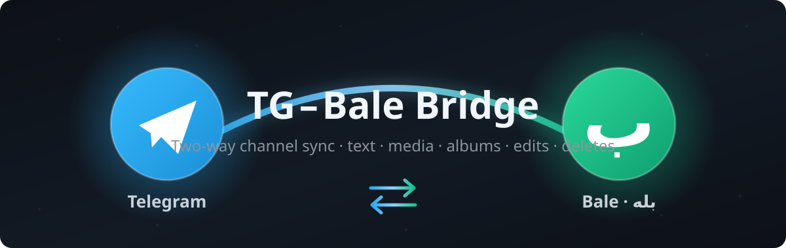
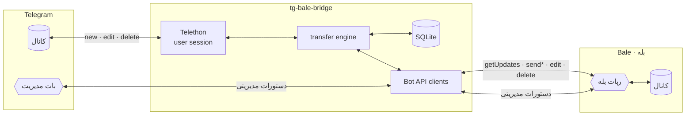

<div align="center">



<br/>

[](https://github.com/parham7991/tg-bale-bridge/actions/workflows/ci.yml)
[](https://www.python.org/)
[](LICENSE)
[](tests/)
[](CONTRIBUTING.md)

**پل دوطرفهٔ همگام‌سازی کانال‌های تلگرام و بله** — هرچه یک‌طرف بگذارید، بی‌کم‌وکاست در طرف دیگر می‌نشیند.<br/>
*Two-way Telegram ⇄ Bale (بله) channel sync bridge — mirror everything.*

</div>

---

## 📑 فهرست

- [✨ چرا این پروژه؟](#-چرا-این-پروژه)
- [🎬 نمای کلی قابلیت‌ها](#-نمای-کلی-قابلیت‌ها)
- [🏗 معماری](#-معماری)
- [🚀 راه‌اندازی سریع](#-راه‌اندازی-سریع)
- [🎛 پنل مدیریت داخل ربات](#-پنل-مدیریت-داخل-ربات)
- [⚙️ پیکربندی](#️-پیکربندی)
- [🧪 تست و توسعه](#-تست-و-توسعه)
- [⚠️ محدودیت‌های صادقانه](#️-محدودیت‌های-صادقانه)
- [🗺 نقشه راه](#-نقشه-راه)
- [🤝 مشارکت](#-مشارکت)
- [📄 مجوز](#-مجوز)

## ✨ چرا این پروژه؟

| ویژگی | توضیح |
|:---|:---|
| 🔁 **دوطرفه واقعی** | با یک پارامتر جهت را انتخاب کنید: `tg2bale` ، `bale2tg` یا `both` |
| 📦 **همه‌چیز** | متن، عکس، ویدیو، وویس، موزیک، گیف، فایل، استیکر، آلبوم چندتایی، فورواردی، ریپلای، لوکیشن، مخاطب |
| ✏️ **ویرایش = ویرایش** | پیام را در تلگرام ادیت کنید → همان پیام در بله ادیت می‌شود (و برعکس) |
| 🗑 **حذف = حذف** | حذف در تلگرام، کپی را در بله پاک می‌کند |
| 🎨 **قالب‌بندی حفظ می‌شود** | بولد/ایتالیک/لینک تلگرام ⇄ Markdown بله |
| 🧩 **بدون حلقه** | نگهبان دو‌لایه (ledger شناسه + اثرانگشت محتوا) مانع بازتاب بی‌نهایت می‌شود |
| 🎛 **تنظیمات داخل ربات** | بدون ویرایش فایل؛ با چند دستور ساده جفت کانال بسازید |
| 🤖 **بات تلگرام برای مدیریت سلف‌بات** | کنترل کامل از راه دور: توقف/ادامه، لاگ زنده، هویت، ساخت جفت — با بات تلگرام |
| 🧪 **۶۶ تست آفلاین** | pytest شامل تست‌های واحد و سرتاسری — CI روی پایتون ۳.۱۰ تا ۳.۱۲ |
| 🐳 **داکر و systemd** | آمادهٔ استقرار روی سرور |

## 🎬 نمای کلی قابلیت‌ها

| محتوا | تلگرام→بله | بله→تلگرام |
|---|:---:|:---:|
| متن + بولد/ایتالیک/لینک | ✅ | ✅ |
| عکس · ویدیو · وویس · موزیک · گیف · فایل | ✅ | ✅ |
| استیکر (به‌صورت تصویر/فایل) | ✅ | ✅ |
| آلبوم (رسانه گروهی) | ✅ | ✅ |
| فورواردی (با ذکر منبع) | ✅ | ✅ |
| جواب/ریپلای (به پیام معادل) | ✅ | ✅ |
| لوکیشن و مخاطب | ✅ | ✅ |
| ویدیوی دایره‌ای | ✅ (با فالبک) | ➖ *API بله ندارد* |
| نظرسنجی و تاس | ✅ (به‌صورت متن) | ➖ |
| **ویرایش پیام** | ✅ | ✅ |
| **حذف پیام** | ✅ | ⛔ *API بله روید حذف نمی‌دهد* |

## 🏗 معماری



مستندات کامل معماری (مودل داده، دیاگرام ترتیب پیام، استراتژی وفاداری):
[**docs/architecture.md**](docs/architecture.md)

## 🚀 راه‌اندازی سریع

```bash
git clone https://github.com/parham7991/tg-bale-bridge.git
cd tg-bale-bridge
python -m venv .venv && source .venv/bin/activate
pip install -r requirements.txt

cp .env.example .env        # ← مقادیر را کامل کنید
python login.py             # ← ورود به تلگرام (یک بار، کد تایید می‌خواهد)
python main.py              # ▶️
```

<details>
<summary>🐳 اجرا با Docker</summary>

```bash
cp .env.example .env        # ← مقادیر را کامل کنید
docker compose run --rm bridge python login.py   # ورود یک‌باره
docker compose up -d
docker compose logs -f
```
</details>

<details>
<summary>🐧 استقرار حرفه‌ای (systemd) و نکات سرور</summary>

به [**docs/DEPLOY.md**](docs/DEPLOY.md) مراجعه کنید.
</details>

**پیش از اجرا:**
1. از [my.telegram.org](https://my.telegram.org) → `api_id` و `api_hash` بگیرید
2. در بله به [`@botfather`](https://ble.ir/botfather) بروید و ربات بسازید → توکن
3. حساب تلگرام عضو کانال(های) مبدأ باشد؛ ربات بله **ادمین** کانال(های) مقصد با دسترسی ارسال/ویرایش/حذف

## 🎛 پنل مدیریت — سه راه کنترل

هر سه جبهه به **یک** پنل مدیریتی وصل‌اند (بات بله · بات تلگرام · پیام‌های ذخیره‌شده):

| دستور | کار |
|---|---|
| `/add <کانال_تلگرام> <کانال_بله> [حالت]` | اتصال دو کانال — نمونه: `/add @tg_ch @bale_ch both` |
| `/list` | فهرست جفت‌های متصل |
| `/mode <id> <حالت>` | تغییر جهت: `both` / `tg2bale` / `bale2tg` |
| `/remove <id>` | حذف یک جفت |
| `/test <id>` | پیام آزمایشی برای اطمینان از اتصال |
| `/id` *(یا فوروارد پیام از کانال)* | گرفتن شناسه عددی کانال‌ها |
| `/whoami` | هویت حساب‌ها: سلف‌بات، ربات بله، بات مدیریت |
| `/pause` · `/resume` | توقف/ادامهٔ موقت همگام‌سازی (ماندگار بین ری‌استارت‌ها) |
| `/logs [n]` | آخرین n خط لاگ زندهٔ برنامه |
| `/status` · `/help` | وضعیت (حالت، جفت‌ها، آمار، زمان فعالیت) و راهنما |

### 🤖 راه‌اندازی بات مدیریت تلگرام (مدیریت سلف‌بات)

1. در تلگرام به [@BotFather](https://t.me/BotFather) بروید → `/newbot` → توکن بگیرید
2. در `.env` بگذارید:
   ```env
   TG_BOT_TOKEN=123456:ABC-DEF...
   ```
3. برنامه را اجرا کنید و به بات جدید پیام `/start` بدهید → آیدی عددی‌تان را می‌گوید
4. آیدی را در `.env` بگذارید و دوباره اجرا کنید:
   ```env
   ADMIN_TG_ID=987654321
   ```
5. تمام! از این پس می‌توانید سلف‌بات را **از هرجا** با این بات مدیریت کنید

> 💡 اگر `TG_BOT_TOKEN` خالی بماند، پل مثل قبل کار می‌کند و فقط این بات غیرفعال است.
> دستورات از داخل **ربات بله** و **پیام‌های ذخیره‌شده تلگرام** هم همیشه در دسترس‌اند.

## ⚙️ پیکربندی

| کلید | الزامی | توضیح |
|---|:---:|---|
| `TG_API_ID` | ✅ | از my.telegram.org |
| `TG_API_HASH` | ✅ | از my.telegram.org |
| `TG_PHONE` | ✅ | شماره تلفن حساب تلگرام |
| `BALE_TOKEN` | ✅ | توکن ربات بله از @botfather |
| `ADMIN_BALE_ID` | ✅ | آیدی عددی شما در بله (برای دستورات) |
| `TG_BOT_TOKEN` | – | توکن بات مدیریت تلگرام (اختیاری — از @BotFather) |
| `ADMIN_TG_ID` | – | آیدی عددی شما در تلگرام (برای دستورات بات مدیریت) |
| `ALBUM_DELAY` | – | تاخیر جمع‌آوری آلبوم، پیش‌فرض `0.9` ثانیه |
| `BALE_POLL_TIMEOUT` | – | مدت long-polling بله، پیش‌فرض `30` ثانیه |
| `DATA_DIR` | – | مسیر دیتابیس و سشن، پیش‌فرض `./data` |

## 🧪 تست و توسعه

```bash
make dev      # نصب وابستگی‌های توسعه
make test     # اجرای ۶۶ تست آفلاین (بدون نیاز به اکانت واقعی)
make lint     # ruff
```

- CI روی هر push / PR: lint + pytest روی پایتون ۳.۱۰ / ۳.۱۱ / ۳.۱۲
- راهنمای مشارکت: [CONTRIBUTING.md](CONTRIBUTING.md)

## ⚠️ محدودیت‌های صادقانه

این‌ها سقف‌های **API خود پلتفرم‌ها** است و در [docs/architecture.md](docs/architecture.md) استراتژی جایگزین هرکدام شرح داده شده:

1. بله برای **حذف پیام** رویداد نمی‌فرستد ⇒ حذفِ بله→تلگرام ممکن نیست (بقیه جهت‌ها ✅)
2. دانلود فایل از بله: سقف `getFile` **۲۰MB** — فایل بزرگ‌تر با پیام اطلاع‌رسانی جایگزین می‌شود
3. آپلود به بله: **۵۰MB** (عکس **۱۰MB**؛ حجیم‌تر به‌صورت فایل می‌رود)
4. پک استیکر بین دو پیام‌رسان مشترک نیست ⇒ ارسال به‌صورت تصویر/فایل
5. بله متن را همیشه با Markdown خودش رندر می‌کند؛ فقط بولد/ایتالیک/لینک قابل ترجمه است
6. نظرات کانال (دیدگاه‌ها) فعلاً همگام نمی‌شوند

## 🗺 نقشه راه

- [x] ✅ **بات مدیریت تلگرام برای کنترل سلف‌بات** (`v1.1.0`)
- [ ] همگام‌سازی دیدگاه‌های (comments) کانال
- [ ] افزونه Bale Business API برای کانال‌های پرحجم
- [ ] تبدیل استیکر TGS به متحرک
- [ ] داشبورد وب برای مدیریت جفت‌ها
- [ ] پشتیبان‌گیری و بازیابی خودکار نگاشت پیام‌ها

## 🤝 مشارکت

ایده‌ها، گزارش باگ و PR خوش‌آمدند — [CONTRIBUTING.md](CONTRIBUTING.md) را ببینید.
اگر این پروژه برایتان مفید بود، ⭐ بزنید!

## 📄 مجوز

[MIT](LICENSE) © 2026 [Parham Khanmohammadi](https://github.com/parham7991)

<div align="center">
<sub>ساخته‌شده با Telethon و عشق — برای جامعهٔ فارسی‌زبان 🇮🇷</sub>
</div>
