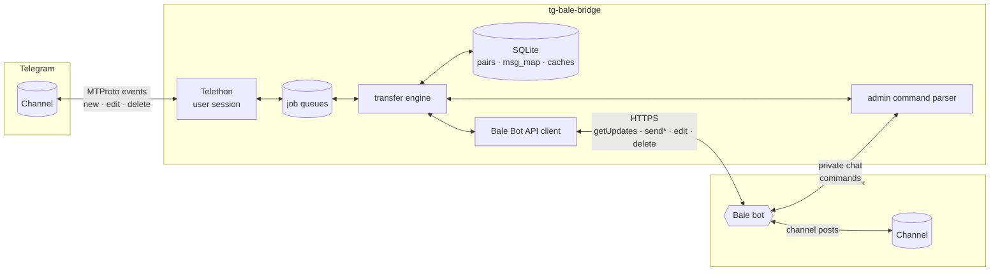
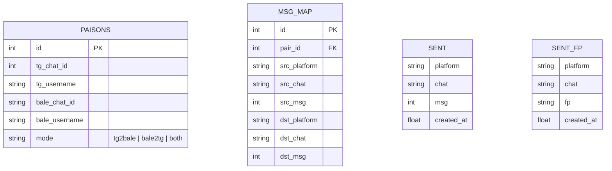
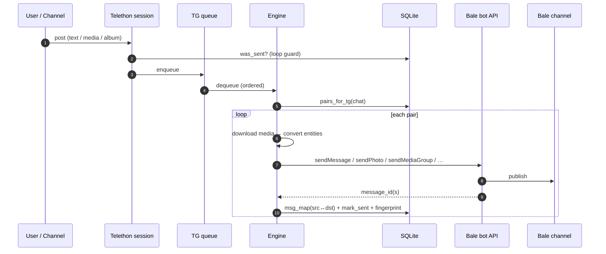

# 🏗 Architecture

## Components

| Component | File | Responsibility |
|---|---|---|
| Telethon session | `bridge/tg_user.py` | Receives `NewMessage` / `MessageEdited` / `MessageDeleted`; routes Saved-Messages to admin, everything else to the engine |
| Job queues | `bridge/transfer.py` | Two FIFO queues (TG→Bale, Bale→TG) keep ordering deterministic |
| Transfer engine | `bridge/transfer.py` | Media classification, download/re-upload, albums, replies, forwards, edits, deletes |
| Bot-API clients | `bridge/bot_api.py` | Generic client for **both** Bale and Telegram Bot API: multipart uploads, file downloads, long-polling, `retry_after` handling |
| Runtime settings | `bridge/store.py` | DB-backed config (accounts, admin, tokens) — `.env` shrinks to one token |
| Web dashboard | `bridge/dashboard.py` + `bridge/dash.html` | Browser control panel: live status, pairs CRUD, pause, logs, access probes, bot promotion — PBKDF2 + session-cookie auth |
| Installer wizard | `bridge/wizard.py` | In-bot setup: Telegram/Bale selfbot logins, Bale bot token, channel pairing with inline buttons, live access probes, auto-restart |
| Bale selfbot adapter | `bridge/bale_user.py` | `BALE_MODE=user`: BotAPI-compatible façade over `aiobale` (logged-in user account). Normalizes internal messages to Bot-API shape and surfaces `message_deleted` events as `deleted_messages` updates — Bale→Telegram delete sync |
| TG control bot | `bridge/tg_bot.py` | Remote management of the self-bot via a Telegram bot (same command panel) |
| Log buffer | `bridge/logbuf.py` | In-memory ring buffer serving the `/logs` command |
| Formatter | `bridge/formatter.py` | Telegram entities ⇄ Bale Markdown, UTF-16 offset math, renderers for polls/dice/venues/services |
| Store | `bridge/db.py` | Channel pairs, message mapping (for replies/edits/deletes), loop-prevention ledger |
| Admin | `bridge/admin.py` | `/add`, `/list`, `/mode`, `/remove`, `/test`, `/id`, `/status`, `/whoami`, `/pause`, `/resume`, `/logs` — the identical panel on 4 surfaces: Bale bot · Bale self-chat · TG control bot · TG Saved Messages |

## Data model

> `msg_map` is the heart of fidelity: it remembers which message on one platform
> corresponds to which message on the other — enabling **replies that stay replies**,
> **edits that edit the mirror**, and **deletes that delete the copy**.

## Message lifecycle (Telegram → Bale)

## Loop prevention (two layers)

1. **ID ledger** — every message the bridge *creates* is recorded (`platform, chat, msg_id`).
   When an event for that exact ID comes back, it is dropped (and the ledger entry consumed).
2. **Content fingerprint** — covers the race where a platform echoes our post *before* our
   HTTP call returns (Bale `getUpdates` vs `sendMessage`). A short-TTL hash of `kind|text`
   suppresses the duplicate.

## Fidelity strategy

| Situation | Strategy |
|---|---|
| Album (media group) | Buffered for `ALBUM_DELAY` seconds, sent via `sendMediaGroup`; falls back to sequential sends |
| Reply | Resolved through `msg_map` to the destination's counterpart message |
| Forward | Content re-uploaded with an attribution header (`🔁 باز‌ارسال از: …`) |
| Edit — text/caption | In-place `editMessageText` / `editMessageCaption` (or `Message.edit`) |
| Edit — media replaced | Delete + resend + `msg_map` row updated |
| Delete (Telegram side) | `deleteMessage` on Bale for every mapped copy |
| Unsupported (poll, dice…) | Human-readable text rendering |
| Oversized files | Upload cap respected (50 MB / 10 MB photos); notice message instead of silent loss |
