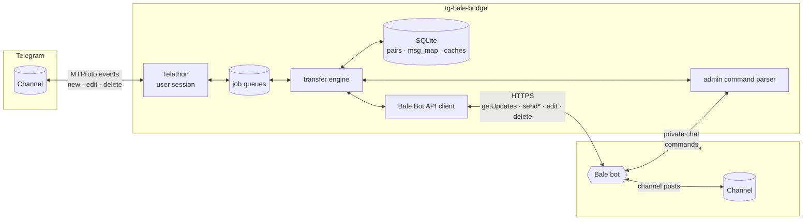
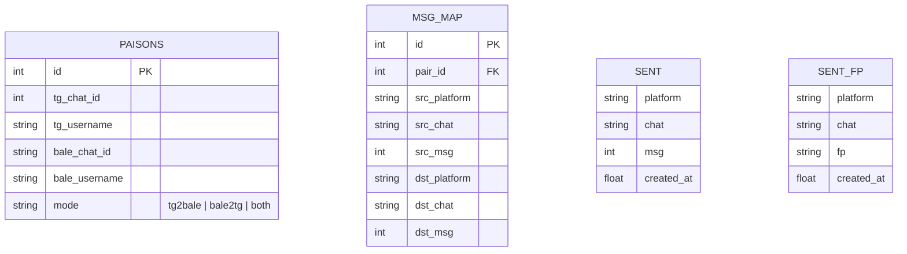
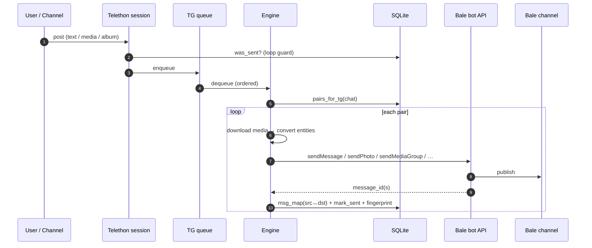

# 🏗 Architecture

## Components

| Component | File | Responsibility |
|---|---|---|
| Telethon session | `bridge/tguser/` → `bridge/tg_user.py` (shim) | Receives `NewMessage` / `MessageEdited` / `MessageDeleted`; routes Saved-Messages to admin, everything else to the engine. Since v2.7.0 implemented as the modular `bridge/tguser/` engine package; `tg_user.py` only re-exports it |
| Job queues | `bridge/transfer/queueing.py` | Two FIFO queues (TG→Bale, Bale→TG) keep ordering deterministic; one worker per side |
| Transfer engine | `bridge/transfer/` (`mirror_t2b` + `mirror_b2t` + `sync_edit` + `sync_delete`) | Media classification, download/re-upload, albums, replies, forwards, edits, deletes — since v2.8.0 as per-section engines |
| Bot-API clients | `bridge/bot_api.py` | Generic client for **both** Bale and Telegram Bot API: multipart uploads, file downloads, long-polling, `retry_after` handling |
| Runtime settings | `bridge/store.py` | DB-backed config (accounts, admin, tokens) — `.env` shrinks to one token |
| Web dashboard | `bridge/dashboard/` (package) | `app.py` assembly · `api.py` thin HTTP · `auth.py` AuthEngine (PBKDF2/sessions/lockout) · `context.py` RuntimeCtx · `engines/{status,pairs,control,logs,ops}` domain engines |
| Admin package | `bridge/admin/` (package) | `types_map` aliases/HELP/parser · `surfaces` SurfacesEngine · `resolver` ResolverEngine (TG resolve + /id) · `pairs_cmds` PairsCommandsEngine · `system_cmds` SystemCommandsEngine · `control_cmds` ControlCommandsEngine · `ops_cmds` OpsCommandsEngine (access/promote) · `dash_cmds` DashCommandsEngine · `probes` compat · `facade` Admin |
| Wizard package | `bridge/wizard/` (package) | `types_map` constants/extractors · `menu` MenuEngine · `accounts` AccountsEngine (Bale API builders + token check) · `pairing` PairingEngine (2-step pairing) · `checks` AccessReportEngine · `promote` PromoteEngine · `dashinfo` DashInfoEngine · `finish` FinishEngine (auto-restart) · `probes` compat functions · `facade` Wizard FSM |
| Transfer package (heart) | `bridge/transfer/` (package) | `types_map` pure mappings (classification/content/entities/fingerprint) · `loopguard` LoopGuard (sent-ledger + fingerprints + echo suppression) · `albums` AlbumCollector (flush timers) · `queueing` QueueEngine (2 FIFOs + workers + pause) · `mirror_t2b` T2BEngine · `mirror_b2t` B2TEngine · `sync_edit` EditSyncEngine · `sync_delete` DeleteSyncEngine · `facade` Bridge |
| TG selfbot package | `bridge/tguser/` (package) | `types_map` pure mappings · `session` TgSelfSession (client builder) · `gateway` TgSelfGateway (credentials/probe/username) · `login` TgLoginEngine (code+2FA) · `routing` TgEventRouter (Saved-Messages=admin) · `events` TgEventsEngine · `facade` TgSelfBot + `register()` |
| TG control-bot package | `bridge/tgbot/` (package) | `types_map` pure mappings · `session` TgBotSession (identity+offset+listen) · `claim` ClaimEngine (first-/start-claims-admin) · `guards` GuardsEngine · `routing` TgBotEventRouter · `facade` TgAdminBot compat façade |
| Bale logic package | `bridge/bale/` (package) | `types_map` pure mappings · `session` BaleSession (client+caches) · `resolver`/`normalize`/`events`/`sender`/`editor`/`files`/`admin_ops`/`profile` engines · `gateway` BaleBotGateway (resolve+probe) · `routing` BaleEventRouter · `login` BaleLoginEngine (phone auth, interactive login, client builder) · `facade` BaleUserAPI compat façade |

| Installer wizard | `bridge/wizard/` → `bridge/wizard.py` (shim) | In-bot setup: Telegram/Bale selfbot logins (delegated to `TgLoginEngine`/`BaleLoginEngine`), Bale bot token, channel pairing with inline buttons, live access probes, auto-restart. Since v2.9.0 implemented as the modular `bridge/wizard/` engine package; `wizard.py` only re-exports it |
| Bale selfbot adapter | `bridge/bale/` → `bridge/bale_user.py` (shim) · one-time login: `python login_bale.py` → `BaleLoginEngine.run_interactive()` | `BALE_MODE=user`: BotAPI-compatible façade over `aiobale` (logged-in user account). Normalizes internal messages to Bot-API shape and surfaces `message_deleted` events as `deleted_messages` updates — Bale→Telegram delete sync. Since v2.4.0 implemented as the modular `bridge/bale/` engine package; `bale_user.py` only re-exports it |
| TG control bot | `bridge/tgbot/` → `bridge/tg_bot.py` (shim) | Remote management of the self-bot via a Telegram bot (same command panel). Since v2.6.0 implemented as the modular `bridge/tgbot/` engine package; `tg_bot.py` only re-exports it |
| Log buffer | `bridge/logbuf.py` | In-memory ring buffer serving the `/logs` command |
| Formatter | `bridge/formatter.py` | Telegram entities ⇄ Bale Markdown, UTF-16 offset math, renderers for polls/dice/venues/services |
| Store | `bridge/db.py` | Channel pairs, message mapping (for replies/edits/deletes), loop-prevention ledger |
| Admin | `bridge/admin/` → `bridge/admin.py` (shim) | `/add`, `/list`, `/mode`, `/remove`, `/test`, `/id`, `/status`, `/whoami`, `/pause`, `/resume`, `/logs`, `/access`, `/promote`, `/dashboard`, `/passwd`, `/dashuser` — the identical panel on 4 surfaces. Since v2.10.0 implemented as the modular `bridge/admin/` engine package; `admin.py` only re-exports it |

## Data model

> `msg_map` is the heart of fidelity: it remembers which message on one platform
> corresponds to which message on the other — enabling **replies that stay replies**,
> **edits that edit the mirror**, and **deletes that delete the copy**.

## Message lifecycle (Telegram → Bale)

## Loop prevention (two layers)

1. **ID ledger** — every message the bridge *creates* is recorded (`platform, chat, msg_id`).
   When an event for that exact ID comes back, it is dropped (and the ledger entry consumed).
2. **Content fingerprint** — covers the race where a platform echoes our post *before* our
   HTTP call returns (Bale `getUpdates` vs `sendMessage`). A short-TTL hash of `kind|text`
   suppresses the duplicate.

## Fidelity strategy

| Situation | Strategy |
|---|---|
| Album (media group) | Buffered for `ALBUM_DELAY` seconds, sent via `sendMediaGroup`; falls back to sequential sends |
| Reply | Resolved through `msg_map` to the destination's counterpart message |
| Forward | Content re-uploaded with an attribution header (`🔁 باز‌ارسال از: …`) |
| Edit — text/caption | In-place `editMessageText` / `editMessageCaption` (or `Message.edit`) |
| Edit — media replaced | Delete + resend + `msg_map` row updated |
| Delete (Telegram side) | `deleteMessage` on Bale for every mapped copy |
| Unsupported (poll, dice…) | Human-readable text rendering |
| Oversized files | Upload cap respected (50 MB / 10 MB photos); notice message instead of silent loss |
